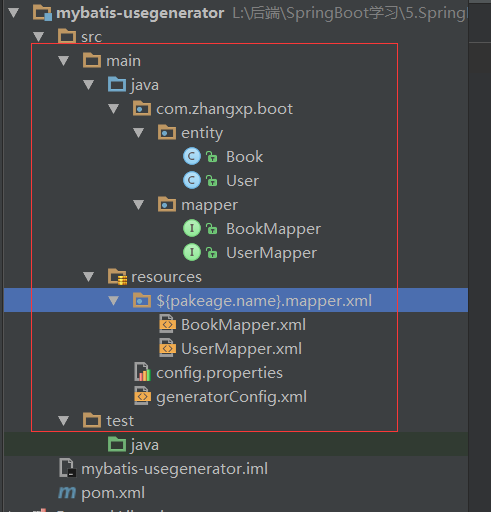

# SpringBoot集成MyBatis

- xml方式
- annotation方式
- maven generate方式
- start方式

MyBatis-Spring-Boot-Starter

## 1. 什么是mybatis?

MyBatis 是一款优秀的持久层框架，它支持自定义 SQL、存储过程以及高级映射。MyBatis 免除了几乎所有的 JDBC 代码以及设置参数和获取结果集的工作。MyBatis 可以通过简单的 XML 或注解来配置和映射原始类型、接口和 Java POJO（Plain Old Java Objects，普通老式 Java 对象）为数据库中的记录。

## 2. MyBatis配置

- 全局XML配置文件
- SQL Mapper XML配置文件
- SQL Mapper Annotation

### 2.1配置

MyBatis 的配置文件包含了会深深影响 MyBatis 行为的设置和属性信息。 配置文档的顶层结构如下：

configuration（配置）

- [properties（属性）](https://mybatis.org/mybatis-3/zh/configuration.html#properties)
- [settings（设置）](https://mybatis.org/mybatis-3/zh/configuration.html#settings)
- [typeAliases（类型别名）](https://mybatis.org/mybatis-3/zh/configuration.html#typeAliases)
- [typeHandlers（类型处理器）](https://mybatis.org/mybatis-3/zh/configuration.html#typeHandlers)
- [objectFactory（对象工厂）](https://mybatis.org/mybatis-3/zh/configuration.html#objectFactory)
- [plugins（插件）](https://mybatis.org/mybatis-3/zh/configuration.html#plugins)
- environments（环境配置）
- environment（环境变量）
- transactionManager（事务管理器）
- dataSource（数据源）
- [databaseIdProvider（数据库厂商标识）](https://mybatis.org/mybatis-3/zh/configuration.html#databaseIdProvider)
- [mappers（映射器）](https://mybatis.org/mybatis-3/zh/configuration.html#mappers)

## 3. 为什么使用MyBatis

不用写jdbc代码，只写sql就行。

## 4. 什么是通用的tk mapper

在使用MyBatis的同时，建议大家再搭配使用"tk Mapper4",它是一个可以实现任意MyBatis通用方法的框架。项目提供了常规的增删改查操作以及Example相关的单表操作。通用Mapper是为了解决MyBatis使用中90%的基本操作，使用它可以很方便的进行开发，可以节省开发人员大量的时间。

官方地址：https://github.com/abel533/Mapper/wiki

## 5. 那为什么需要通用的tk mapper?

mybatis最大的一个问题，就是要写大量的SQL在XML中，因为除了必须的特殊复杂业务逻辑SQL外，还要为大量类似增删改查写SQL。另外，当数据库表结构变更时，所有对应的SQL和实体类都要改一遍。故，通用tk mapper应运而生。

一句话：不用写jdbc代码，同时不用写基本的SQL。(97%是不用写sql的，剩下的是多表关联查询。)


## 6. Mybatis代码生成器

### 6.1 什么是Mybatis代码生成器?

MyBatis Generator(简称为：MyBatis代码生成器)是MyBatis官方出品的一款，用来自动生成MyBatis的mapper,xml,entiiy,操作非常简单，只要在配置文件中，配置好要生成的表名和包名，然后运行命令，就能自动生成mapper,xml,entity等一堆文件。

官网地址：http://www.mybatis.org/generator/

### 6.2 MyBatis Generator搭建步骤:

#### 步骤一:新建数据库和表

#### 步骤二:导入依赖包

```xml
<?xml version="1.0" encoding="UTF-8"?>
<project xmlns="http://maven.apache.org/POM/4.0.0"
         xmlns:xsi="http://www.w3.org/2001/XMLSchema-instance"
         xsi:schemaLocation="http://maven.apache.org/POM/4.0.0 http://maven.apache.org/xsd/maven-4.0.0.xsd">
    <modelVersion>4.0.0</modelVersion>

    <groupId>com.zhangxp</groupId>
    <artifactId>mybatis-usegenerator</artifactId>
    <version>1.0-SNAPSHOT</version>

    <properties>
        <project.build.sourceEncoding>UTF-8</project.build.sourceEncoding>
        <project.reporting.outputEncoding>UTF-8</project.reporting.outputEncoding>
        <java.version>1.8</java.version>
        <mybaits.version>1.3.2</mybaits.version>
        <mybatisplus.version>3.0.1</mybatisplus.version>
        <springboot.version>2.1.2.RELEASE</springboot.version>
        <mysql.version>8.0.11</mysql.version>
        <mapper.version>3.4.5</mapper.version>
        <basedir>L:\后端\SpringBoot学习\5.SpringBoot集成MyBatis详解\mybatis-usegenerator</basedir>
    </properties>

    <dependencies>
        <!-- mybatis generator -->
        <dependency>
            <groupId>org.mybatis.generator</groupId>
            <artifactId>mybatis-generator-core</artifactId>
            <version>1.3.6</version>
            <scope>compile</scope>
            <optional>true</optional>
        </dependency>
        <!-- 通用mapper -->
        <dependency>
            <groupId>tk.mybatis</groupId>
            <artifactId>mapper</artifactId>
            <version>${mapper.version}</version>
        </dependency>
    </dependencies>
    <build>
        <resources>
            <resource>
                <directory>${basedir}/src/main/java</directory>
                <includes>
                    <include>**/*.xml</include>
                </includes>
            </resource>
            <resource>
                <directory>${basedir}/src/main/resources</directory>
            </resource>
        </resources>
        <plugins>
            <plugin>
                <artifactId>maven-compiler-plugin</artifactId>
                <configuration>
                    <source>1.8</source>
                    <target>1.8</target>
                </configuration>
            </plugin>
            <plugin>
                <groupId>org.mybatis.generator</groupId>
                <artifactId>mybatis-generator-maven-plugin</artifactId>
                <version>1.3.6</version>
                <configuration>
                    <configurationFile>${basedir}/src/main/resources/generatorConfig.xml</configurationFile>
                    <overwrite>true</overwrite>
                    <verbose>true</verbose>
                </configuration>
                <dependencies>
                    <dependency>
                        <groupId>mysql</groupId>
                        <artifactId>mysql-connector-java</artifactId>
                        <version>${mysql.version}</version>
                    </dependency>
                    <dependency>
                        <groupId>tk.mybatis</groupId>
                        <artifactId>mapper</artifactId>
                        <version>${mapper.version}</version>
                    </dependency>
                </dependencies>
            </plugin>
        </plugins>
    </build>
</project>
```

#### 步骤三： 2个核心配置文件:

config.properties:

```properties
# 生成的包名
package.name=com.zhangxp.boot

# 数据库配置信息
jdbc.driverClass = com.mysql.jdbc.Driver
jdbc.url = jdbc:mysql://192.168.200.129:3308/mytest
jdbc.user = root
jdbc.password = 7324368Best!@
```

generatorConfig.xml

```xml
<?xml version="1.0" encoding="UTF-8"?>
<!DOCTYPE generatorConfiguration
        PUBLIC "-//mybatis.org//DTD MyBatis Generator Configuration 1.0//EN"
        "http://mybatis.org/dtd/mybatis-generator-config_1_0.dtd">
<!-- 配置生成器 -->
<generatorConfiguration>
    <!-- 可以用于加载配置项或者配置文件，在整个配置文件中就可以使用${propertyKey}的方式来引用配置项
        resource：配置资源加载地址，使用resource，MBG从classpath开始找，比如com/myproject/generatorConfig.properties
        url：配置资源加载地质，使用URL的方式，比如file:///C:/myfolder/generatorConfig.properties.
        注意，两个属性只能选址一个;

        另外，如果使用了mybatis-generator-maven-plugin，那么在pom.xml中定义的properties都可以直接在generatorConfig.xml中使用
    <properties resource="" url="" />
     -->

    <!-- 在MBG工作的时候，需要额外加载的依赖包
        location属性指明加载jar/zip包的全路径
   <classPathEntry location="/Program Files/IBM/SQLLIB/java/db2java.zip" />
     -->

    <!--
        context:生成一组对象的环境
        id:必选，上下文id，用于在生成错误时提示
        defaultModelType:指定生成对象的样式
            1，conditional：类似hierarchical；
            2，flat：所有内容（主键，blob）等全部生成在一个对象中；
            3，hierarchical：主键生成一个XXKey对象(key class)，Blob等单独生成一个对象，其他简单属性在一个对象中(record class)
        targetRuntime:
            1，MyBatis3：默认的值，生成基于MyBatis3.x以上版本的内容，包括XXXBySample；
            2，MyBatis3Simple：类似MyBatis3，只是不生成XXXBySample；
        introspectedColumnImpl：类全限定名，用于扩展MBG
    -->
    <properties resource="config.properties"/>
    <context id="Mysql" defaultModelType="flat" targetRuntime="MyBatis3Simple" >

        <!-- 自动识别数据库关键字，默认false，如果设置为true，根据SqlReservedWords中定义的关键字列表；
            一般保留默认值，遇到数据库关键字（Java关键字），使用columnOverride覆盖
         -->
        <!--<property name="autoDelimitKeywords" value="false"/>-->
        <!--&lt;!&ndash; 生成的Java文件的编码 &ndash;&gt;-->
        <!--<property name="javaFileEncoding" value="UTF-8"/>-->
        <!--&lt;!&ndash; 格式化java代码 &ndash;&gt;-->
        <!--<property name="javaFormatter" value="org.mybatis.generator.api.dom.DefaultJavaFormatter"/>-->
        <!--&lt;!&ndash; 格式化XML代码 &ndash;&gt;-->
        <!--<property name="xmlFormatter" value="org.mybatis.generator.api.dom.DefaultXmlFormatter"/>-->

        <!-- beginningDelimiter和endingDelimiter：指明数据库的用于标记数据库对象名的符号，比如ORACLE就是双引号，MYSQL默认是`反引号； -->
        <property name="beginningDelimiter" value="`"/>
        <property name="endingDelimiter" value="`"/>
        <plugin type="tk.mybatis.mapper.generator.MapperPlugin">
            <property name="mappers" value="tk.mybatis.mapper.common.Mapper"/>
            <property name="caseSensitive" value="true"/>
        </plugin>

        <!-- 必须要有的，使用这个配置链接数据库
            @TODO:是否可以扩展
         -->
        <jdbcConnection driverClass="${jdbc.driverClass}" connectionURL="${jdbc.url}" userId="${jdbc.user}" password="${jdbc.password}">
            <!-- 这里面可以设置property属性，每一个property属性都设置到配置的Driver上 -->
        </jdbcConnection>

        <!-- java类型处理器
            用于处理DB中的类型到Java中的类型，默认使用JavaTypeResolverDefaultImpl；
            注意一点，默认会先尝试使用Integer，Long，Short等来对应DECIMAL和 NUMERIC数据类型；
        -->
        <!--<javaTypeResolver type="org.mybatis.generator.internal.types.JavaTypeResolverDefaultImpl">-->
            <!--
                true：使用BigDecimal对应DECIMAL和 NUMERIC数据类型
                false：默认,
                    scale>0;length>18：使用BigDecimal;
                    scale=0;length[10,18]：使用Long；
                    scale=0;length[5,9]：使用Integer；
                    scale=0;length<5：使用Short；
             -->
            <!--<property name="forceBigDecimals" value="false"/>-->
        <!--</javaTypeResolver>-->


        <!-- java模型创建器，是必须要的元素
            负责：1，key类（见context的defaultModelType）；2，java类；3，查询类
            targetPackage：生成的类要放的包，真实的包受enableSubPackages属性控制；
            targetProject：目标项目，指定一个存在的目录下，生成的内容会放到指定目录中，如果目录不存在，MBG不会自动建目录
         -->
        <javaModelGenerator targetPackage="${package.name}.entity" targetProject="src/main/java">
            <!--  for MyBatis3/MyBatis3Simple
                自动为每一个生成的类创建一个构造方法，构造方法包含了所有的field；而不是使用setter；
             -->
            <!--<property name="constructorBased" value="false"/>-->

            <!--&lt;!&ndash; 在targetPackage的基础上，根据数据库的schema再生成一层package，最终生成的类放在这个package下，默认为false &ndash;&gt;-->
            <!--<property name="enableSubPackages" value="true"/>-->

            <!--&lt;!&ndash; for MyBatis3 / MyBatis3Simple-->
                <!--是否创建一个不可变的类，如果为true，-->
                <!--那么MBG会创建一个没有setter方法的类，取而代之的是类似constructorBased的类-->
             <!--&ndash;&gt;-->
            <!--<property name="immutable" value="false"/>-->

            <!-- 设置一个根对象，
                如果设置了这个根对象，那么生成的keyClass或者recordClass会继承这个类；在Table的rootClass属性中可以覆盖该选项
                注意：如果在key class或者record class中有root class相同的属性，MBG就不会重新生成这些属性了，包括：
                    1，属性名相同，类型相同，有相同的getter/setter方法；
             -->
            <!--<property name="rootClass" value="com._520it.mybatis.domain.BaseDomain"/>-->

            <!--&lt;!&ndash; 设置是否在getter方法中，对String类型字段调用trim()方法 &ndash;&gt;-->
            <!--<property name="trimStrings" value="true"/>-->
        </javaModelGenerator>


        <!-- 生成SQL map的XML文件生成器，
            注意，在Mybatis3之后，我们可以使用mapper.xml文件+Mapper接口（或者不用mapper接口），
                或者只使用Mapper接口+Annotation，所以，如果 javaClientGenerator配置中配置了需要生成XML的话，这个元素就必须配置
            targetPackage/targetProject:同javaModelGenerator
         -->
        <sqlMapGenerator targetPackage="${pakeage.name}.mapper.xml" targetProject="src/main/resources">
            <!-- 在targetPackage的基础上，根据数据库的schema再生成一层package，最终生成的类放在这个package下，默认为false -->
            <!--<property name="enableSubPackages" value="true"/>-->
        </sqlMapGenerator>


        <!-- 对于mybatis来说，即生成Mapper接口，注意，如果没有配置该元素，那么默认不会生成Mapper接口
            targetPackage/targetProject:同javaModelGenerator
            type：选择怎么生成mapper接口（在MyBatis3/MyBatis3Simple下）：
                1，ANNOTATEDMAPPER：会生成使用Mapper接口+Annotation的方式创建（SQL生成在annotation中），不会生成对应的XML；
                2，MIXEDMAPPER：使用混合配置，会生成Mapper接口，并适当添加合适的Annotation，但是XML会生成在XML中；
                3，XMLMAPPER：会生成Mapper接口，接口完全依赖XML；
            注意，如果context是MyBatis3Simple：只支持ANNOTATEDMAPPER和XMLMAPPER
        -->
        <javaClientGenerator targetPackage="${package.name}.mapper" type="XMLMAPPER" targetProject="src/main/java">
            <!-- 在targetPackage的基础上，根据数据库的schema再生成一层package，最终生成的类放在这个package下，默认为false -->
            <!--<property name="enableSubPackages" value="true"/>-->

            <!-- 可以为所有生成的接口添加一个父接口，但是MBG只负责生成，不负责检查
            <property name="rootInterface" value=""/>
             -->
        </javaClientGenerator>

        <!-- 选择一个table来生成相关文件，可以有一个或多个table，必须要有table元素
            选择的table会生成一下文件：
            1，SQL map文件
            2，生成一个主键类；
            3，除了BLOB和主键的其他字段的类；
            4，包含BLOB的类；
            5，一个用户生成动态查询的条件类（selectByExample, deleteByExample），可选；
            6，Mapper接口（可选）

            tableName（必要）：要生成对象的表名；
            注意：大小写敏感问题。正常情况下，MBG会自动的去识别数据库标识符的大小写敏感度，在一般情况下，MBG会
                根据设置的schema，catalog或tablename去查询数据表，按照下面的流程：
                1，如果schema，catalog或tablename中有空格，那么设置的是什么格式，就精确的使用指定的大小写格式去查询；
                2，否则，如果数据库的标识符使用大写的，那么MBG自动把表名变成大写再查找；
                3，否则，如果数据库的标识符使用小写的，那么MBG自动把表名变成小写再查找；
                4，否则，使用指定的大小写格式查询；
            另外的，如果在创建表的时候，使用的""把数据库对象规定大小写，就算数据库标识符是使用的大写，在这种情况下也会使用给定的大小写来创建表名；
            这个时候，请设置delimitIdentifiers="true"即可保留大小写格式；

            可选：
            1，schema：数据库的schema；
            2，catalog：数据库的catalog；
            3，alias：为数据表设置的别名，如果设置了alias，那么生成的所有的SELECT SQL语句中，列名会变成：alias_actualColumnName
            4，domainObjectName：生成的domain类的名字，如果不设置，直接使用表名作为domain类的名字；可以设置为somepck.domainName，那么会自动把domainName类再放到somepck包里面；
            5，enableInsert（默认true）：指定是否生成insert语句；
            6，enableSelectByPrimaryKey（默认true）：指定是否生成按照主键查询对象的语句（就是getById或get）；
            7，enableSelectByExample（默认true）：MyBatis3Simple为false，指定是否生成动态查询语句；
            8，enableUpdateByPrimaryKey（默认true）：指定是否生成按照主键修改对象的语句（即update)；
            9，enableDeleteByPrimaryKey（默认true）：指定是否生成按照主键删除对象的语句（即delete）；
            10，enableDeleteByExample（默认true）：MyBatis3Simple为false，指定是否生成动态删除语句；
            11，enableCountByExample（默认true）：MyBatis3Simple为false，指定是否生成动态查询总条数语句（用于分页的总条数查询）；
            12，enableUpdateByExample（默认true）：MyBatis3Simple为false，指定是否生成动态修改语句（只修改对象中不为空的属性）；
            13，modelType：参考context元素的defaultModelType，相当于覆盖；
            14，delimitIdentifiers：参考tableName的解释，注意，默认的delimitIdentifiers是双引号，如果类似MYSQL这样的数据库，使用的是`（反引号，那么还需要设置context的beginningDelimiter和endingDelimiter属性）
            15，delimitAllColumns：设置是否所有生成的SQL中的列名都使用标识符引起来。默认为false，delimitIdentifiers参考context的属性

            注意，table里面很多参数都是对javaModelGenerator，context等元素的默认属性的一个复写；
         -->
        <table tableName="user" domainObjectName="User">
            <generatedKey column="id" sqlStatement="JDBC"/>
        </table>
        <table tableName="Book" domainObjectName="Book">
            <generatedKey column="id" sqlStatement="JDBC"/>
        </table>

            <!-- 参考 javaModelGenerator 的 constructorBased属性-->
            <!--<property name="constructorBased" value="false"/>-->

            <!--&lt;!&ndash; 默认为false，如果设置为true，在生成的SQL中，table名字不会加上catalog或schema； &ndash;&gt;-->
            <!--<property name="ignoreQualifiersAtRuntime" value="false"/>-->

            <!--&lt;!&ndash; 参考 javaModelGenerator 的 immutable 属性 &ndash;&gt;-->
            <!--<property name="immutable" value="false"/>-->

            <!--&lt;!&ndash; 指定是否只生成domain类，如果设置为true，只生成domain类，如果还配置了sqlMapGenerator，那么在mapper XML文件中，只生成resultMap元素 &ndash;&gt;-->
            <!--<property name="modelOnly" value="false"/>-->

            <!-- 参考 javaModelGenerator 的 rootClass 属性
            <property name="rootClass" value=""/>
             -->

            <!-- 参考javaClientGenerator 的  rootInterface 属性
            <property name="rootInterface" value=""/>
            -->

            <!-- 如果设置了runtimeCatalog，那么在生成的SQL中，使用该指定的catalog，而不是table元素上的catalog
            <property name="runtimeCatalog" value=""/>
            -->

            <!-- 如果设置了runtimeSchema，那么在生成的SQL中，使用该指定的schema，而不是table元素上的schema
            <property name="runtimeSchema" value=""/>
            -->

            <!-- 如果设置了runtimeTableName，那么在生成的SQL中，使用该指定的tablename，而不是table元素上的tablename
            <property name="runtimeTableName" value=""/>
            -->

            <!-- 注意，该属性只针对MyBatis3Simple有用；
                如果选择的runtime是MyBatis3Simple，那么会生成一个SelectAll方法，如果指定了selectAllOrderByClause，那么会在该SQL中添加指定的这个order条件；
             -->
            <!--<property name="selectAllOrderByClause" value="age desc,username asc"/>-->

            <!--&lt;!&ndash; 如果设置为true，生成的model类会直接使用column本身的名字，而不会再使用驼峰命名方法，比如BORN_DATE，生成的属性名字就是BORN_DATE,而不会是bornDate &ndash;&gt;-->
            <!--<property name="useActualColumnNames" value="false"/>-->


            <!-- generatedKey用于生成生成主键的方法，
                如果设置了该元素，MBG会在生成的<insert>元素中生成一条正确的<selectKey>元素，该元素可选
                column:主键的列名；
                sqlStatement：要生成的selectKey语句，有以下可选项：
                    Cloudscape:相当于selectKey的SQL为： VALUES IDENTITY_VAL_LOCAL()
                    DB2       :相当于selectKey的SQL为： VALUES IDENTITY_VAL_LOCAL()
                    DB2_MF    :相当于selectKey的SQL为：SELECT IDENTITY_VAL_LOCAL() FROM SYSIBM.SYSDUMMY1
                    Derby      :相当于selectKey的SQL为：VALUES IDENTITY_VAL_LOCAL()
                    HSQLDB      :相当于selectKey的SQL为：CALL IDENTITY()
                    Informix  :相当于selectKey的SQL为：select dbinfo('sqlca.sqlerrd1') from systables where tabid=1
                    MySql      :相当于selectKey的SQL为：SELECT LAST_INSERT_ID()
                    SqlServer :相当于selectKey的SQL为：SELECT SCOPE_IDENTITY()
                    SYBASE      :相当于selectKey的SQL为：SELECT @@IDENTITY
                    JDBC      :相当于在生成的insert元素上添加useGeneratedKeys="true"和keyProperty属性
            <generatedKey column="" sqlStatement=""/>
             -->

            <!--
                该元素会在根据表中列名计算对象属性名之前先重命名列名，非常适合用于表中的列都有公用的前缀字符串的时候，
                比如列名为：CUST_ID,CUST_NAME,CUST_EMAIL,CUST_ADDRESS等；
                那么就可以设置searchString为"^CUST_"，并使用空白替换，那么生成的Customer对象中的属性名称就不是
                custId,custName等，而是先被替换为ID,NAME,EMAIL,然后变成属性：id，name，email；

                注意，MBG是使用java.util.regex.Matcher.replaceAll来替换searchString和replaceString的，
                如果使用了columnOverride元素，该属性无效；

            <columnRenamingRule searchString="" replaceString=""/>
             -->


            <!-- 用来修改表中某个列的属性，MBG会使用修改后的列来生成domain的属性；
                column:要重新设置的列名；
                注意，一个table元素中可以有多个columnOverride元素哈~
             -->
            <!--<columnOverride column="username">-->
                <!--&lt;!&ndash; 使用property属性来指定列要生成的属性名称 &ndash;&gt;-->
                <!--<property name="property" value="userName"/>-->

                <!--&lt;!&ndash; javaType用于指定生成的domain的属性类型，使用类型的全限定名-->
                <!--<property name="javaType" value=""/>-->
                 <!--&ndash;&gt;-->

                <!--&lt;!&ndash; jdbcType用于指定该列的JDBC类型-->
                <!--<property name="jdbcType" value=""/>-->
                 <!--&ndash;&gt;-->

                <!--&lt;!&ndash; typeHandler 用于指定该列使用到的TypeHandler，如果要指定，配置类型处理器的全限定名-->
                    <!--注意，mybatis中，不会生成到mybatis-config.xml中的typeHandler-->
                    <!--只会生成类似：where id = #{id,jdbcType=BIGINT,typeHandler=com._520it.mybatis.MyTypeHandler}的参数描述-->
                <!--<property name="jdbcType" value=""/>-->
                <!--&ndash;&gt;-->

                <!--&lt;!&ndash; 参考table元素的delimitAllColumns配置，默认为false-->
                <!--<property name="delimitedColumnName" value=""/>-->
                 <!--&ndash;&gt;-->
            <!--</columnOverride>-->

            <!-- ignoreColumn设置一个MGB忽略的列，如果设置了改列，那么在生成的domain中，生成的SQL中，都不会有该列出现
                column:指定要忽略的列的名字；
                delimitedColumnName：参考table元素的delimitAllColumns配置，默认为false

                注意，一个table元素中可以有多个ignoreColumn元素
            <ignoreColumn column="deptId" delimitedColumnName=""/>
            -->
        <!--</table>-->

    </context>

</generatorConfiguration>
```

步骤四： 运行generator插件:


可以看到自动生成的代码:

